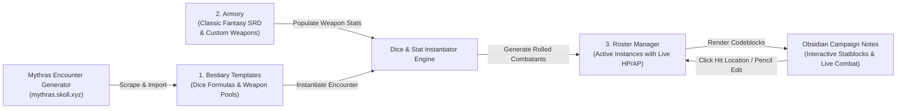

# Mythras Encounter Plugin for Obsidian

[](https://obsidian.md)
[](http://thedesignmechanism.com/)
[](LICENSE)

A complete encounter, bestiary, armory, and combat management suite for Game Masters running **Mythras** (and d100 / BRP systems) in [Obsidian](https://obsidian.md).

This plugin bridges the gap between the fan-project online [Mythras Encounter Generator](https://mythras.skoll.xyz/about/) and your local Obsidian Vault. It enables offline template management, authentic local dice rolling, dynamic encounter building, live interactive statblocks, real-time Hit Location wound tracking, and seamless inline weapon references directly inside your campaign notes.

---

## Table of Contents
1. [Core Architecture: The Three Pillars](#core-architecture-the-three-pillars)
   - [1. The Bestiary](#1-the-bestiary)
   - [2. The Armory](#2-the-armory)
   - [3. The Roster Manager](#3-the-roster-manager)
2. [Installation & Initial Setup](#installation--initial-setup)
3. [User Guide & Workflows](#user-guide--workflows)
   - [Step 1: Building the Bestiary (Search, Import & Customization)](#step-1-building-the-bestiary-search-import--customization)
   - [Step 2: Managing the Armory & In-Note Item Statblocks](#step-2-managing-the-armory--in-note-item-statblocks)
   - [Step 3: Creating Encounters & Instantiating Enemies](#step-3-creating-encounters--instantiating-enemies)
   - [Step 4: Running Combat & Interactive Hit Location Tracking](#step-4-running-combat--interactive-hit-location-tracking)
4. [Syntax & Codeblock Cheatsheet](#syntax--codeblock-cheatsheet)
5. [The Mythras Rules & Math Engine](#the-mythras-rules--math-engine)
6. [Commands & Navigation](#commands--navigation)

---

## Core Architecture: The Three Pillars

The plugin organizes Mythras combat management into three interconnected pillars stored cleanly within your Vault:

```
<Your Vault>/Mythras-Helper/
├── Bestiary/       # Reusable JSON enemy templates (with dice formulas & weapon pools)
├── Armory/         # Central weapon catalog (Classic Fantasy SRD + custom homebrew)
└── Roster/         # Instantiated combatant JSON records (with active HP/AP state)
```



### 1. The Bestiary
- **Purpose:** Your template library of monsters, NPCs, beasts, and adversaries.
- **Storage:** Stored as JSON files in `<baseFolder>/Bestiary/<template_name>_by_<author>.json`.
- **How it works:** Rather than storing flat, rolled statistics, Bestiary templates preserve **raw dice formulas** (e.g. `STR = 3d6+6`, `Brawn = STR+SIZ`, `1d8+1` damage), hit location armor/formula profiles, combat styles, standard/custom/magic skills, notes, and weapon pools.
- **Author-Namespaced:** Prevents naming collisions when importing templates created by different authors.
- **Customizable:** Edit formulas, hit locations, skill formulas, image links, and optional weapon groups directly inside Obsidian.

### 2. The Armory
- **Purpose:** The centralized weapons, shields, and ranged equipment catalog for your campaign.
- **Storage:** Stored in `<baseFolder>/Armory/armory.json`.
- **Pre-Seeded:** Comes pre-loaded with **over 60 standard weapons and shields** sourced directly from the *Classic Fantasy Imperative SRD*.
- **Features:**
  - Full support for 1H Melee, 2H Melee, Ranged (with Range and Load times), and Shields.
  - Comprehensive weapon properties: Damage, Size, Reach, Range, AP, HP, Damage Modifier flag, Special Effects (*Impale*, *Bleed*, *Entangle*, *Stun*, etc.), Traits, and Notes.
  - One-click **Repopulate Armory** button that resets to SRD defaults while automatically creating timestamped backups (`armory_backup_<timestamp>.json`).
  - Powers in-note autocompletion, inline hover tooltips (`` `item: Weapon Name` ``), and block-level weapon cards (````item\nWeapon Name\n````).

### 3. The Roster Manager
- **Purpose:** The tactical command center for active campaigns and live encounters.
- **Storage:** Instantiated enemies live as individual JSON files in `<baseFolder>/Roster/<instance_id>_<name>.json`.
- **Hierarchy:** Organizes combatants into **Scenarios** (e.g., *Deep Mines*, *Act 2 - City*) and **Encounters** (e.g., *Gate Ambush*, *Chieftain's Lair*).
- **Stateful Combat Tracking:** Unlike static text statblocks, Roster instances maintain real-time combat state: Current Hit Points (wounds) and Current Armor Points per Hit Location, custom name overrides, and individual notes.
- **Two-Pane UI:** A desktop-class workspace with a Scenario navigation tree, Encounter Tag-Cloud filter, multi-select bulk operations (move, duplicate, delete), quick snippet copying, and a tabbed deep-editor.

---

## Installation & Initial Setup

1. Enable the plugin in your Obsidian Settings (`Community plugins` -> `Mythras Encounter Plugin`).
2. *(Optional)* In the plugin settings tab, configure the **Base Folder** (defaults to `Mythras-Helper`).
   - The plugin automatically creates and manages the `Bestiary/`, `Armory/`, and `Roster/` subdirectories inside this folder.
3. Open the **Mythras Manager Workspace Leaf**:
   - **Ribbon Icon:** Click the `swords` icon in the left ribbon.
   - **Right-Click Ribbon Icon:** Open the manager in a *New Tab*, *Split Right*, *Split Down*, or *Current Tab*.
   - **Command Palette:** Run `Mythras: Open Mythras Manager` or open from the plugin settings.

---

## User Guide & Workflows

### Step 1: Building the Bestiary (Search, Import & Customization)

#### Importing Templates
1. Use `⌘/Ctrl + P` to open the Command Palette and search for "Mythras".
2. Select **`Import Template from Mythras Encounter Generator`**.
3. Type a search query (minimum 3 characters, e.g., `Goblin`, `Bandit`, `Skeleton`, `Dragon`).
4. The modal queries the official online database and displays results with Rank, Race, Creator, and Tags.
5. Select a template and press `Enter` (or click). The plugin scrapes the full template—extracting attributes, hit locations, features, standard/custom/magic skills, combat styles, and weapon options—and saves it to `<baseFolder>/Bestiary/`.

#### Managing & Editing Templates
1. Open the **Mythras Manager** and switch to the **Bestiary** tab.
2. Filter templates by tags or sort by *Name*, *Author*, *Rank*, or *Last Modified*.
3. Click on any entry to view the **Detail View** or click **Edit** to modify:
   - **Characteristics & Formulas:** Adjust formulas like `2d6+6` or base attribute rules.
   - **Hit Locations:** Add, remove, or modify body zones, D20 roll ranges, and armor points.
   - **Weapon Pools:** Define fixed weapons or **optional weighted weapon pools** (e.g., roll `1d2` weapons from a pool with relative probability weights).
   - **Images:** Link local vault images using the fuzzy file finder, external image URLs, or base64 strings.
   - **Skills & Combat Styles:** Add or tune skill base formulas and custom specialties.

---

### Step 2: Managing the Armory & In-Note Item Statblocks

#### The Armory Manager
- In the **Mythras Manager**, navigate to the **Armory** tab.
- Switch between **Melee**, **Ranged**, and **Shields** filters.
- Click **Add Weapon** to create custom weapons or click any weapon to edit its characteristics.
- Click **Repopulate with Defaults** at any time to restore the complete Classic Fantasy SRD catalog.

#### Referencing Items in Notes
You can reference any armory weapon anywhere in your vault:

##### 1. Inline Hover Tooltip
Type `` `item: Weapon Name` `` in your markdown text (an autocompletion suggester will appear as you type):

```markdown
The guard draws his `item: Shortsword` and readies a `item: Viking Shield`.
```

In reading view and Live Preview, this transforms into a styled badge. Hovering over it displays an interactive popover with SVG icons for Damage, Size, Reach/Range, AP/HP, Load time, Special Effects, and Traits.

##### 2. Block-Level Item Statblock
Use a dedicated ````item```` codeblock to embed a full-width equipment card:

````markdown
```item
Heavy Crossbow
```
````

---

### Step 3: Creating Encounters & Instantiating Enemies

When you generate enemies, the plugin executes a roll using the Mythras dice engine:
- Generates characteristics from formulas (e.g., `3d6` for STR, `2d6+6` for SIZ).
- Calculates secondary attributes: Action Points, Damage Modifier, Strike Rank / Initiative, Magic Points, and Movement.
- Computes base Hit Location HP using the official formula: $\lceil(\text{CON} + \text{SIZ}) / 5\rceil$, applying regional modifiers (+2 chest, +1 abdomen, -1 arms).
- Evaluates skill formulas based on rolled characteristics.
- Resolves weapon selections: rolls optional weapon quantities and picks from weighted random pools without replacement, automatically merging stats from your Armory.

#### Method A: Generating via the Command / Modal
1. Run **`Generate Mythras Encounter`** from the Command Palette (or click **Generate Enemies** in the Roster Manager).
2. Choose:
   - **Template:** The Bestiary template to roll.
   - **Amount:** Number of combatant instances to generate.
   - **Scenario:** The overarching scenario group (e.g., `Dungeon Level 1`).
   - **Encounter:** The encounter name (e.g., `Goblin Ambush`).
3. Click **Generate**. The instances are saved to your Roster, and if you have an active note open, corresponding ````enemy <id>```` codeblocks are inserted directly at your cursor position!

#### Method B: Creating Encounter Notes (`type: mythras-encounter`)
You can turn any note in your vault into an interactive Encounter Sheet:

1. Add the following YAML frontmatter to your note:
   ```yaml
   ---
   type: mythras-encounter
   scenario: "Deep Caverns"
   ---
   ```
   *(Note: The plugin will automatically generate and inject a unique `encounter-id` UUID if one is not present).*
2. Add your room description, tactical notes, or ambient text in the Markdown body.
3. Insert the ````mythras-encounter```` codeblock:
   ````markdown
   # Ambush in the Caverns
   The party enters a damp chamber lit only by bioluminescent fungi.

   ```mythras-encounter
   ```
   ````
4. The note dynamically renders:
   - The Encounter Title and Scenario badge.
   - A **Quick-Edit Pencil Button** that opens this encounter directly in the Roster Manager.
   - The rendered Markdown description.
   - A grid of all enemy statblocks assigned to this encounter.

---

### Step 4: Running Combat & Interactive Hit Location Tracking

#### The Live Enemy Statblock
Whether embedded via ````enemy <id>```` or rendered as part of a ````mythras-encounter```` grid, every statblock delivers an all-in-one combat dashboard:

- **Header:** Instance Name, Template Name, and linked Portrait/Image.
- **Top Bar:** Characteristics grid (STR, CON, SIZ, DEX, INT, POW, CHA) and Derived Attributes (AP, Dmg Mod, Init/SR, Move, MP).
- **Hit Location Pills:** Compact badges showing D20 range, body zone name, and `(Current AP / Current HP)`.
- **Combat Styles & Weapons:** Displays active weapons, damage with calculated damage modifiers, size, reach/range, and special effects.
- **Standard & Magic Skills:** Formatted percentages with internal Obsidian links for skill lookups.
- **Pencil Icon:** Instant shortcut to open and edit the full instance in the Roster Manager.

#### Direct Hit Location Click-to-Edit (New Feature!)
During fast-paced combat, you do not need to open side panels to record wounds or armor degradation:

1. **Click directly on any Hit Location pill** in the statblock (e.g., `10-12 | Chest (3/6)`).
2. The **Hit Location Quick Edit Modal** opens instantly:
   - **Current AP:** Adjust remaining armor points (e.g., after sunder or penetration).
   - **Current HP:** Enter remaining hit points (or negative hit points for severe wounds).
3. Press `Enter` or click **Save**.
4. **Instant Persistence & Sync:** 
   - The new values are saved immediately to the instance's JSON file in `<baseFolder>/Roster/`.
   - All open notes and views referencing this enemy update immediately in real-time.
   - Modified hit locations are **visually highlighted** in red/bold (`is-modified` state) so you can identify wounded body parts at a glance.

---

## Syntax & Codeblock Cheatsheet

| Syntax | Description | Example |
| :--- | :--- | :--- |
| ```` ```enemy <id> ``` ```` | Renders a compact live statblock for a specific combatant. | ```` ```enemy 1787844127518493 ``` ```` |
| ```` ```enemy <id> long ``` ```` | Renders a full expanded statblock including all skills and notes. | ```` ```enemy 1787844127518493 long ``` ```` |
| ```` ```mythras-encounter ``` ```` | Renders the complete encounter grid for the current note. | ```` ```mythras-encounter ``` ```` |
| ```` ```mythras-encounter<br>id: <uuid><br>format: long<br>``` ```` | Renders an encounter by ID with full-format statblocks. | ```` ```mythras-encounter<br>id: 2ecf721d-bd58-42e7-8445-7a644fa838ca<br>format: long<br>``` ```` |
| ```` ```item<br><Weapon Name><br>``` ```` | Renders a full equipment statblock card from the Armory. | ```` ```item<br>Broadsword<br>``` ```` |
| `` `item: <Weapon Name>` `` | Inline weapon badge with hover statblock popover. | `` `item: Heavy Crossbow` `` |

---

## The Mythras Rules & Math Engine

The plugin strictly follows official Mythras Core Rules:

- **Base Hit Points per Location:**
  $$\text{Base HP} = \left\lceil \frac{\text{CON} + \text{SIZ}}{5} \right\rceil$$
  - **Chest / Thorax / Forequarter:** $\text{Base HP} + 2$
  - **Abdomen / Hindquarter:** $\text{Base HP} + 1$
  - **Head / Legs:** $\text{Base HP} + 0$
  - **Arms / Wings / Forelegs / Tentacles:** $\text{Base HP} - 1$
- **Action Points (AP):** Calculated from $\text{INT} + \text{DEX}$ (e.g., $\le 12 \rightarrow 1\text{ AP}$, $13\text{--}24 \rightarrow 2\text{ AP}$, $25\text{--}36 \rightarrow 3\text{ AP}$, $37\text{--}48 \rightarrow 4\text{ AP}$).
- **Damage Modifier:** Calculated from $\text{STR} + \text{SIZ}$ progression ($-1\text{d8}$ up to $+2\text{d12}$ and beyond).
- **Strike Rank / Initiative:** $\left\lceil \frac{\text{INT} + \text{DEX}}{2} \right\rceil$.
- **Magic Points:** Equal to current $\text{POW}$.
- **Weighted Weapon Selection:** Evaluates probability weights without replacement when picking optional equipment groups.

---

## Commands & Navigation

| Command | Action |
| :--- | :--- |
| **`Import Template from Mythras Encounter Generator`** | Opens search modal to download templates directly from `mythras.skoll.xyz`. |
| **`Generate Mythras Encounter`** | Opens generation modal to roll enemies from local Bestiary templates. |
| **Open Mythras Manager** | Opens the tabbed Manager leaf (Roster, Armory, Bestiary) via ribbon icon or settings. |

---

## License

MIT License. Mythras is a trademark of *The Design Mechanism*. This plugin is an independent tool designed for tabletop roleplaying game preparation.
