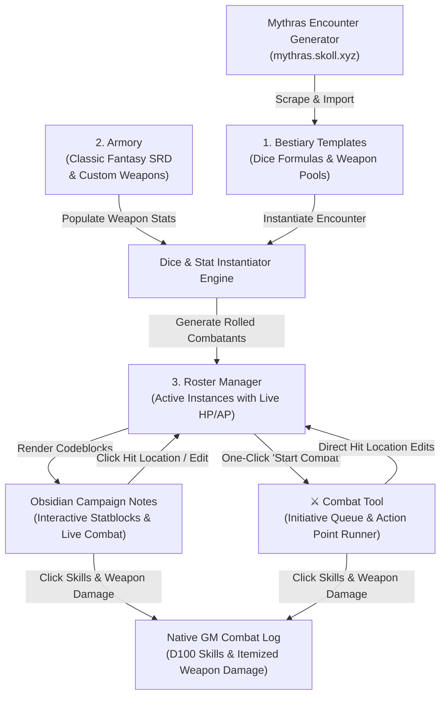

# Mythras Encounter Plugin for Obsidian

[](https://obsidian.md)
[](http://thedesignmechanism.com/)
[](CHANGELOG.md)
[](LICENSE)

A complete encounter, bestiary, armory, and tactical combat management suite for Game Masters running **Mythras** (and d100 / BRP systems) in [Obsidian](https://obsidian.md).

This plugin bridges the gap between the fan-project online [Mythras Encounter Generator](https://mythras.skoll.xyz/about/) and your local Obsidian Vault. It enables offline template management, authentic local dice rolling, dynamic encounter building, live interactive statblocks, real-time Hit Location wound tracking, one-click d100 skill checks, interactive weapon damage rolls with full dice breakdown, a dedicated GM Combat Log, seamless inline weapon references, and a full-featured **Mythras Combat Tool (Initiative & Action Point Runner)** directly inside your campaign notes and workspace.

---

## Table of Contents
1. [Core Architecture: The Three Pillars](#core-architecture-the-three-pillars)
   - [1. The Bestiary](#1-the-bestiary)
   - [2. The Armory](#2-the-armory)
   - [3. The Roster Manager](#3-the-roster-manager)
2. [Installation & Initial Setup](#installation--initial-setup)
3. [User Guide & Workflows](#user-guide--workflows)
   - [Step 1: Building the Bestiary (Search, Import & Customization)](#step-1-building-the-bestiary-search-import--customization)
   - [Step 2: Managing the Armory & In-Note Item Statblocks](#step-2-managing-the-armory--in-note-item-statblocks)
   - [Step 3: Creating Encounters & Instantiating Enemies](#step-3-creating-encounters--instantiating-enemies)
   - [Step 4: Running Combat & Interactive Hit Location Tracking](#step-4-running-combat--interactive-hit-location-tracking)
   - [Step 5: Native GM Combat Log & Click-to-Roll](#step-5-native-gm-combat-log--click-to-roll)
   - [Step 6: ⚔️ Mythras Combat Tool (Initiative & Action Point Tracker)](#step-6-️-mythras-combat-tool-initiative--action-point-tracker)
4. [Syntax & Codeblock Cheatsheet](#syntax--codeblock-cheatsheet)
5. [The Mythras Rules & Math Engine](#the-mythras-rules--math-engine)
6. [Commands & Navigation](#commands--navigation)
7. [Attribution & Licenses](#attribution--licenses)

---

## Core Architecture: The Three Pillars

The plugin organizes Mythras combat management into three interconnected pillars stored cleanly within your Vault:

```
<Your Vault>/Mythras-Helper/
├── Bestiary/       # Reusable JSON enemy templates (with dice formulas & weapon pools)
├── Armory/         # Central weapon catalog (Classic Fantasy SRD + custom homebrew)
└── Roster/         # Instantiated combatant JSON records (with active HP/AP state)
```



### 1. The Bestiary
- **Purpose:** Your template library of monsters, NPCs, beasts, and adversaries.
- **Storage:** Stored as JSON files in `<baseFolder>/Bestiary/<template_name>_by_<author>.json`.
- **How it works:** Rather than storing flat, rolled statistics, Bestiary templates preserve **raw dice formulas** (e.g., `STR = 3d6+6`, `Brawn = STR+SIZ`, `1d8+1` damage), hit location armor/formula profiles, combat styles, standard/custom/magic skills, notes, and weapon pools.
- **Author-Namespaced:** Prevents naming collisions when importing templates created by different community authors.
- **Customizable:** Edit formulas, hit locations, skill formulas, image links, and optional weapon groups directly inside Obsidian.

### 2. The Armory
- **Purpose:** The centralized weapons, shields, and ranged equipment catalog for your campaign.
- **Storage:** Stored in `<baseFolder>/Armory/armory.json`.
- **Pre-Seeded:** Comes pre-loaded with **over 60 standard weapons and shields** sourced directly from the *Classic Fantasy Imperative SRD*.
- **Features:**
  - Full support for 1H Melee, 2H Melee, Ranged (with Range and Load times), and Shields.
  - Comprehensive weapon properties: Damage, Size, Reach, Range, AP, HP, Damage Modifier flag, Special Effects (*Impale*, *Bleed*, *Entangle*, *Stun*, etc.), Traits, and Notes.
  - One-click **Repopulate Armory** button that resets to SRD defaults while automatically creating timestamped backups (`armory_backup_<timestamp>.json`).
  - Powers in-note autocompletion, inline hover tooltips (`` `item: Weapon Name` ``), and block-level weapon cards (````item\nWeapon Name\n````).

### 3. The Roster Manager
- **Purpose:** The tactical command center for active campaigns and live encounters.
- **Storage:** Instantiated enemies live as individual JSON files in `<baseFolder>/Roster/<instance_id>_<name>.json`.
- **Hierarchy:** Organizes combatants into **Scenarios** (e.g., *Deep Mines*, *Act 2 - City*) and **Encounters** (e.g., *Gate Ambush*, *Chieftain's Lair*).
- **Stateful Combat Tracking:** Unlike static text statblocks, Roster instances maintain real-time combat state: Current Hit Points (wounds) and Current Armor Points per Hit Location, custom name overrides, and individual notes.
- **Two-Pane UI:** A desktop-class workspace with a Scenario navigation tree, Encounter Tag-Cloud filter, multi-select bulk operations (move, duplicate, delete), quick snippet copying, and a tabbed deep-editor.
- **Deep Editing:** Dynamically adjust core stats, add or modify individual Hit Locations, and freely add, edit, or remove standard, professional, and magic skills directly on the combatant instance to represent unique variations.

---

## Installation & Initial Setup

1. Enable the plugin in your Obsidian Settings (`Community plugins` -> `Mythras Encounter Plugin`).
2. *(Optional)* In the plugin settings tab, configure the **Base Folder** (defaults to `Mythras-Helper`).
   - The plugin automatically creates and manages the `Bestiary/`, `Armory/`, and `Roster/` subdirectories inside this folder.
3. Open the **Mythras Manager Workspace Leaf**:
   - **Ribbon Icon:** Click the `swords` icon in the left ribbon.
   - **Right-Click Ribbon Icon:** Open the manager in a *New Tab*, *Split Right*, *Split Down*, or *Current Tab*.
   - **Command Palette:** Run `Mythras: Open Mythras Manager` or open from the plugin settings.
4. Open the **GM Combat Log Leaf**:
   - **Ribbon Icon:** Click the `list` icon in the left ribbon.
   - **Command Palette:** Run `Mythras: Open Combat Log`.
   - The Combat Log docks neatly into the right sidebar.

---

## User Guide & Workflows

### Step 1: Building the Bestiary (Search, Import & Customization)

#### Importing Templates from the Web
1. Open the Command Palette (`Ctrl/Cmd + P`) and select **`Import Template from Mythras Encounter Generator`**.
2. Type a search query (minimum 3 characters, e.g., `Goblin`, `Bandit`, `Skeleton`, `Dragon`).
3. The modal queries the official online database and displays results with Rank, Race, Creator, and Tags.
4. Select a template and press `Enter` (or click). The plugin scrapes the full template—extracting attributes, hit locations, features, standard/custom/magic skills, combat styles, and weapon options—and saves it to `<baseFolder>/Bestiary/`.

#### Managing & Editing Templates
1. Open the **Mythras Manager** (`swords` icon) and switch to the **Bestiary** tab.
2. Filter templates by tags or sort by *Name*, *Author*, *Rank*, or *Last Modified*.
3. Click on any entry to view the **Detail View** or click **Edit** to modify:
   - **Characteristics & Formulas:** Adjust formulas like `2d6+6` or base attribute rules.
   - **Hit Locations:** Add, remove, or modify body zones, D20 roll ranges, and armor points.
   - **Weapon Pools:** Define fixed weapons or **optional weighted weapon pools** (e.g., roll `1d2` weapons from a pool with relative probability weights).
   - **Images:** Link local vault images using the fuzzy file finder, external image URLs, or base64 strings.
   - **Skills & Combat Styles:** Add or tune skill base formulas and custom specialties.

---

### Step 2: Managing the Armory & In-Note Item Statblocks

#### The Armory Manager
- In the **Mythras Manager**, navigate to the **Armory** tab.
- Switch between **Melee**, **Ranged**, and **Shields** filters.
- Click **Add Weapon** to create custom weapons or click any weapon to edit its characteristics.
- Click **Repopulate with Defaults** at any time to restore the complete Classic Fantasy SRD catalog.

#### Referencing Items in Notes
You can reference any armory weapon anywhere in your vault:

##### 1. Inline Hover Tooltip
Type `` `item: Weapon Name` `` in your markdown text (an autocompletion suggester will appear as you type):

```markdown
The guard draws his `item: Shortsword` and readies a `item: Viking Shield`.
```

In reading view and Live Preview, this transforms into a styled badge. Hovering over it displays an interactive popover with SVG icons for Damage, Size, Reach/Range, AP/HP, Load time, Special Effects, and Traits.

##### 2. Block-Level Item Statblock
Use a dedicated ````item```` codeblock to embed a full-width equipment card:

````markdown
```item
Heavy Crossbow
```
````

---

### Step 3: Creating Encounters & Instantiating Enemies

When you generate enemies, the plugin executes a roll using the Mythras dice engine:
- Generates characteristics from formulas (e.g., `3d6` for STR, `2d6+6` for SIZ).
- Calculates secondary attributes: Action Points, Damage Modifier, Strike Rank / Initiative, Magic Points, and Movement.
- Computes base Hit Location HP using the official formula: $\lceil(\text{CON} + \text{SIZ}) / 5\rceil$, applying regional modifiers (+2 chest, +1 abdomen, -1 arms).
- Evaluates skill formulas based on rolled characteristics.
- Resolves weapon selections: rolls optional weapon quantities and picks from weighted random pools without replacement, automatically merging stats from your Armory.

#### Method A: Generating via the Command / Modal
1. Run **`Generate Mythras Encounter`** from the Command Palette (or click **Generate Enemies** in the Roster Manager).
2. Choose:
   - **Template:** The Bestiary template to roll.
   - **Amount:** Number of combatant instances to generate.
   - **Scenario:** The overarching scenario group (e.g., `Dungeon Level 1`).
   - **Encounter:** The encounter name (e.g., `Goblin Ambush`).
3. Click **Generate**. The instances are saved to your Roster, and if you have an active note open, corresponding ````enemy <id>```` codeblocks are inserted directly at your cursor position!

#### Method B: Creating Encounter Notes (`type: mythras-encounter`)
You can turn any note in your vault into an interactive Encounter Sheet:

1. Add the following YAML frontmatter to your note:
   ```yaml
   ---
   type: mythras-encounter
   scenario: "Deep Caverns"
   ---
   ```
   *(Note: The plugin will automatically generate and inject a unique `encounter-id` UUID if one is not present).*
2. Add your room description, tactical notes, or ambient text in the Markdown body.
3. Insert the ````mythras-encounter```` codeblock:
   ````markdown
   # Ambush in the Caverns
   The party enters a damp chamber lit only by bioluminescent fungi.

   ```mythras-encounter
   ```
   ````
4. The note dynamically renders:
   - The Encounter Title and Scenario badge.
   - A **Quick-Edit Pencil Button** that opens this encounter directly in the Roster Manager.
   - The rendered Markdown description.
   - A responsive grid of all enemy statblocks assigned to this encounter.

---

### Step 4: Running Combat & Interactive Hit Location Tracking

#### The Live Enemy Statblock
Whether embedded via ````enemy <id>```` or rendered as part of a ````mythras-encounter```` grid, every statblock delivers an all-in-one combat dashboard:

- **Header:** Instance Name, Template Name, and linked Portrait/Image.
- **Top Bar:** Characteristics grid (STR, CON, SIZ, DEX, INT, POW, CHA) and Derived Attributes (AP, Dmg Mod, Init/SR, Move, MP).
- **Hit Location Pills:** Compact badges showing D20 range, body zone name, and `(Current AP / Current HP)`.
- **Combat Styles & Weapons:** Displays active weapons, damage with calculated damage modifiers, size, reach/range, special effects, and **interactive rollable damage pills**.
- **Standard & Magic Skills:** Formatted percentages with internal Obsidian links for skill lookups.
- **Pencil Icon:** Instant shortcut to open and edit the full instance in the Roster Manager.

#### Direct Hit Location Click-to-Edit
During fast-paced combat, you do not need to open side panels to record wounds or armor degradation:

1. **Click directly on any Hit Location pill** in the statblock (e.g., `10-12 | Chest (3/6)`).
2. The **Hit Location Quick Edit Modal** opens instantly:
   - **Current AP:** Adjust remaining armor points (e.g., after sunder or armor penetration).
   - **Current HP:** Enter remaining hit points (or negative hit points for severe wounds).
3. Press `Enter` or click **Save**.
4. **Instant Persistence & Real-Time Sync:** 
   - The new values are saved immediately to the instance's JSON file in `<baseFolder>/Roster/`.
   - All open notes and views referencing this enemy update immediately in real-time.
   - Modified hit locations are **visually highlighted** in red/bold (`is-modified` state) so you can identify wounded body parts at a glance.

---

### Step 5: Native GM Combat Log & Click-to-Roll

The plugin features a native dice roller, interactive damage calculations, and a dedicated **GM Combat Log** directly inside Obsidian's right sidebar.

```
┌────────────────────────────────────────────────────────┐
│ COMBAT LOG                                 [Clear Log] │
├────────────────────────────────────────────────────────┤
│ [19:42:20] Goblin Archer #1 attacked with Shortbow     │
│ Damage: 1d6 [4] - 1d4 [1] = 3                          │
├────────────────────────────────────────────────────────┤
│ Goblin Archer #1                            [19:42:15] │
│ Bow & Arrow (65%) → Roll: 04 → [CRITICAL]              │
├────────────────────────────────────────────────────────┤
│ [19:42:10] Cave Troll #2 attacked with Great Club      │
│ Damage: 2d8 [5+7] + 1d12 [11] = 23                     │
├────────────────────────────────────────────────────────┤
│ Cave Troll #2                               [19:42:08] │
│ Club (58%) → Roll: 42 → [SUCCESS]                      │
├────────────────────────────────────────────────────────┤
│ Bandit Leader                               [19:41:50] │
│ Evade (45%) → Roll: 81 → [FAILURE]                     │
├────────────────────────────────────────────────────────┤
│ Cultist Initiate                            [19:41:30] │
│ Willpower (32%) → Roll: 100 → [FUMBLE]                 │
└────────────────────────────────────────────────────────┘
```

#### 1. Click-to-Roll Skill & Combat Style Checks
Every skill percentage in your statblocks—including **Combat Styles**, **Standard Skills**, **Magic Skills**, **Professional Skills**, and **Custom Skills**—is rendered as an interactive roll button (e.g., `Brawn: 62%`, `Spear & Shield: 74%`).

- **Click the percentage pill** to roll a `1d100` skill check for that combatant.
- The roll automatically resolves against the target skill rating according to official Mythras rules:
  - 🔵 **Critical Success:** Roll $\le \lceil \text{Skill Target} / 10 \rceil$ (e.g., $\le 7$ for a $64\%$ skill).
  - 🟢 **Success:** Roll $\le \text{Skill Target}$.
  - 🔴 **Failure:** Roll $> \text{Skill Target}$ (and $< 99$).
  - 🟣 **Fumble:** Roll $\ge 99$ (99 or 100).

#### 2. Click-to-Roll Weapon Damage & Itemized Dice Breakdown
Every weapon listed in an encounter or enemy statblock features an interactive damage pill (e.g., `1d8+1d2`, `1d6-1d4`, `2d8+1d12`).

- **Click the weapon damage pill** to roll damage directly during combat.
- **Damage Modifier Factoring:** The plugin automatically incorporates the combatant's Damage Modifier into the weapon's formula based on their $\text{STR} + \text{SIZ}$ (unless the weapon specifically does not use damage modifiers).
- **Rules-Compliant Minimum Flooring:** If a character with a negative damage modifier rolls poorly, the total damage is automatically floored to a minimum of **0** ($\max(0, \text{Total})$), preventing negative damage values.
- **Itemized Visual Breakdown:** The GM Combat Log UI renders a beautifully styled breakdown displaying:
  - Individual dice rolled and their face results in badges (e.g., `2d8 [5+7]`, `1d12 [11]`).
  - Mathematical operators (`+`, `-`) and numeric constants.
  - A distinct, highlighted total damage badge (e.g., `= 23`).
- **Instant Focus:** Rolling damage automatically switches focus to the GM Combat Log sidebar so you can review rolls in real time.

#### 3. The GM Combat Log View & Management
- Whenever a skill check or weapon damage roll is clicked, the **Combat Log** view in the right sidebar is automatically brought into focus.
- Entries are organized chronologically with latest actions on top:
  - **Skill Check Entries:** Displays Actor Name, Timestamp (`[HH:MM:SS]`), Action & Target %, Rolled D100 Value, and a Color-Coded Success Level Badge (Critical, Success, Failure, Fumble).
  - **Weapon Damage Entries:** Displays Actor Name, Timestamp, Weapon Name, the itemized Dice Breakdown badges, and final Total Damage badge.
- **Clear Log Button:** Click the "Clear Log" button in the header at any time to clear history between rounds or encounters.

---

### Step 6: ⚔️ Mythras Combat Tool (Initiative & Action Point Tracker)

The **Mythras Combat Tool** is a dedicated tactical combat runner designed specifically for the unique mechanics of the Mythras ruleset (Initiative ordering, multi-pass Action Point cycles, and locational wound tracking).

```
┌─────────────────────────────────────────────────────────────────────────────────────────────┐
│ COMBAT TRACKER: Goblin Ambush (Deep Caverns)                [Round: 1 | Cycle: 2]           │
│ [+ Add Encounter] [+ Add Enemy] [🎲 Roll Init All]                                  [Clear] │
├───────────────────────────────────────────────┬─────────────────────────────────────────────┤
│ INITIATIVE ORDER (4)   [⏭ Next Cycle] [🔄 Next Round]│ COMBAT INSPECTOR                           │
├───────────────────────────────────────────────┼─────────────────────────────────────────────┤
│ ▼ ACTIVE TURNS                                │ Goblin Chieftain (Elite)                    │
│ ┌───────────────────────────────────────────┐ │ STR: 14  CON: 13  SIZ: 12  DEX: 15  INT: 13 │
│ │ ⚔️ Goblin Chieftain (Elite)     Init [18]  │ │ AP: 3  Dmg Mod: +1d2  Init: 14  Move: 6m   │
│ │ AP: [●] [●] [○]                   [-1 AP] │ ├───────────────────────────────────────────┤
│ │ Head: 🛡️3 💧4  Chest: 🛡️4 💧6  Abdomen: 🛡️4 💧5│ │ HIT LOCATIONS                             │
│ │ [✓ Turn Done]                         [X] │ │ 01-03 | Right Leg (2/5)                   │
│ └───────────────────────────────────────────┘ │ 04-06 | Left Leg (2/5)                    │
│                                               │ 07-09 | Abdomen (4/5)                       │
│ ┌───────────────────────────────────────────┐ │ 10-12 | Chest (4/6)                         │
│ │ Cave Troll                     Init [14]  │ │ 13-15 | Right Arm (2/4)                   │
│ │ AP: [●] [●]                       [-1 AP] │ │ 16-18 | Left Arm (2/4)                    │
│ │ Head: 🛡️1 💧7  Chest: 🛡️2 💧9 [-] [+]       │ │ 19-20 | Head (3/4)                        │
│ │ [✓ Turn Done]                         [X] │ ├───────────────────────────────────────────┤
│ └───────────────────────────────────────────┘ │ COMBAT STYLES & WEAPONS                     │
│                                               │ Spear & Shield (72%)                        │
│ ▼ TURN DONE IN CYCLE (1)                      │ • Shortspear (1d8+1+1d2, M, L) [Roll Dmg]   │
│ ┌───────────────────────────────────────────┐ │ • Target Shield (1d4+1d2, M, S)             │
│ │ Goblin Archer #1 (AP: 1)       Init [12]  │ ├───────────────────────────────────────────┤
│ │ [↩ Reactivate]                            │ │ STANDARD & MAGIC SKILLS                   │
│ └───────────────────────────────────────────┘ │ Athletics: 58% | Brawn: 65% | Evade: 60%    │
│                                               │ [✏️ Edit Combatant Instance]                │
└───────────────────────────────────────────────┴─────────────────────────────────────────────┘
```

#### 1. Launching Combat in One Click
- **From the Roster Manager:** Click the prominent **`⚔️ Start Combat`** CTA button on any encounter header. All enemy instances in that encounter are instantly imported into the Combat Tracker with rolled initiatives and ready Action Points.
- **From the Mythras Manager:** Click the **`⚔️ Combat Tracker`** tab in the top navigation bar at any time.
- **Mid-Combat Reinforcements:** Use the **`+ Add Encounter`** or **`+ Add Enemy`** buttons in the toolbar to seamlessly introduce reinforcements or wandering monsters without disrupting the active battle.

#### 2. Automated Mythras Initiative Engine
- **Authentic Formula:** When combat begins (or when clicking **`🎲 Roll Init All`**), the plugin calculates each combatant's base **Strike Rank** ($\lceil(\text{INT} + \text{DEX}) / 2\rceil$) and rolls a local $1\text{d10}$ die.
- **Dynamic Sorting:** Participants are automatically ordered descending by net Initiative ($\text{Strike Rank} + 1\text{d10}$).
- **Hover Breakdown:** Hovering over any participant's `Init` badge reveals the exact mathematical breakdown (e.g., `Strike Rank: 13 + Roll: 🎲5`).
- **Individual Rerolls:** Reroll initiative for any specific participant at any time.

#### 3. Two-Column Tactical Interface

##### Left Column: Miniature Initiative Queue
- **52px VTT Token Portraits:** Displays local vault images or external web portraits with transparent PNG support and soft drop shadows (`filter: drop-shadow(0 2px 5px rgba(0, 0, 0, 0.3))`).
- **Action Point (AP) Dot Trackers:** Visual filled/empty dots (`[●] [●] [○]`) represent remaining Action Points. Click any dot to set remaining AP directly, or click the **`-1 AP`** button to expend an action.
- **Miniature Hit Location Health & Armor Badges:** Compact location pills show remaining Armor Points (🛡️ shield icon) and Hit Points (💧 droplet icon).
  - Wounded locations are highlighted in yellow/orange; severed or disabled locations ($\le 0\text{ HP}$) are highlighted in red.
  - Quick **`-`** and **`+`** buttons let you adjust Hit Location HP on the fly with a single click.
- **Turn State & Visual Groupings:**
  - **Active Turns:** Combatants with remaining AP who have not yet acted in the current cycle. The current actor is highlighted with a distinct active-turn border and ⚔️ icon.
  - **Turn Done in Cycle:** Combatants who took their turn pass in this cycle but still possess remaining AP for subsequent cycles.
  - **0 AP & Turn Done:** Combatants whose AP has been exhausted for the round, neatly sequestered at the bottom.
- **Turn Done Toggle:** Clicking **`✓ Turn Done`** marks the actor's turn pass as complete, re-sorts the queue, and automatically selects the next active combatant in line. Clicking **`↩ Reactivate`** returns them to the active queue.

##### Right Column: Interactive Combat Inspector
- **Unabridged Live Statblock:** Clicking any participant card in the queue immediately displays their complete, full-depth statblock in the right pane.
- **Click-to-Roll Directly in Combat:** Trigger D100 skill checks and rolled weapon damage directly from the inspector; results route immediately into the right sidebar GM Combat Log.
- **In-Place Enemy Instance Deep Editing:** Click the pencil icon on the inspector header to open the `EnemyInstanceEditModal`. Freely modify attributes, add/remove hit locations, change equipment, or adjust skill percentages mid-fight.
- **Instant Disk Sync:** All changes made in the Combat Tracker (wounds, armor damage, AP) automatically sync to `<baseFolder>/Roster/<instance_id>.json` on disk and persist across app reloads via `<baseFolder>/Roster/.combat_session.json`.

#### 4. Turn Pass (Cycle) vs. Round Progression Engine
Combat in Mythras uses multiple Action Point passes per round. The Combat Tool provides dedicated controls for this workflow:

- **⏭ Next Cycle (Turn Pass):**
  - Advances the **Cycle** counter (e.g., `Round 1 | Cycle 1` $\rightarrow$ `Round 1 | Cycle 2`).
  - Reactivates all combatants who still have remaining Action Points ($\text{AP} > 0$), clearing their `isDone` status.
  - **Action Points are strictly preserved** (they do not reset).
  - Automatically selects the first active combatant at the top of the queue.
- **🔄 Next Round:**
  - Advances the **Round** counter (e.g., `Round 1` $\rightarrow$ `Round 2`) and resets the Cycle counter to `1`.
  - **Fully restores Action Points** for every participant back to their maximum rating ($\text{Current AP} = \text{Max AP}$).
  - Clears all `isDone` statuses and readies the entire roster for the new round.

---

## Syntax & Codeblock Cheatsheet

| Syntax | Description | Example |
| :--- | :--- | :--- |
| ```` ```enemy <id> ``` ```` | Renders a compact live statblock for a specific combatant. | ```` ```enemy 1787844127518493 ``` ```` |
| ```` ```enemy <id> long ``` ```` | Renders a full expanded statblock including all skills and notes. | ```` ```enemy 1787844127518493 long ``` ```` |
| ```` ```mythras-encounter ``` ```` | Renders the complete encounter grid for the current note. | ```` ```mythras-encounter ``` ```` |
| ```` ```mythras-encounter\nid: <uuid>\nformat: long\n``` ```` | Renders an encounter by ID with full-format statblocks. | ```` ```mythras-encounter\nid: 2ecf721d-bd58-42e7-8445-7a644fa838ca\nformat: long\n``` ```` |
| ```` ```item\n<Weapon Name>\n``` ```` | Renders a full equipment statblock card from the Armory. | ```` ```item\nBroadsword\n``` ```` |
| `` `item: <Weapon Name>` `` | Inline weapon badge with hover statblock popover. | `` `item: Heavy Crossbow` `` |

---

## The Mythras Rules & Math Engine

The plugin strictly implements official Mythras Core Rules:

- **Base Hit Points per Location:**
  $$\text{Base HP} = \left\lceil \frac{\text{CON} + \text{SIZ}}{5} \right\rceil$$
  - **Chest / Thorax / Forequarter:** $\text{Base HP} + 2$
  - **Abdomen / Hindquarter:** $\text{Base HP} + 1$
  - **Head / Legs:** $\text{Base HP} + 0$
  - **Arms / Wings / Forelegs / Tentacles:** $\text{Base HP} - 1$
- **Action Points (AP):** Calculated from $\text{INT} + \text{DEX}$ (e.g., $\le 12 \rightarrow 1\text{ AP}$, $13\text{--}24 \rightarrow 2\text{ AP}$, $25\text{--}36 \rightarrow 3\text{ AP}$, $37\text{--}48 \rightarrow 4\text{ AP}$).
- **Damage Modifier:** Calculated from $\text{STR} + \text{SIZ}$ progression ($-1\text{d8}$ up to $+2\text{d12}$ and beyond).
- **Weapon Damage Resolution:**
  $$\text{Damage} = \max(0, \text{Weapon Base Dice} \pm \text{Damage Modifier})$$
  Evaluates compound dice formulas (e.g., `2d8+1d12+2`), tracks individual die roll components, and clamps negative sums to 0.
- **Strike Rank / Initiative:** $\left\lceil \frac{\text{INT} + \text{DEX}}{2} \right\rceil$.
- **Initiative Roll:** $\text{Strike Rank} + 1\text{d10}$.
- **Magic Points:** Equal to current $\text{POW}$.
- **Skill Checks & Success Levels:**
  - **Critical:** $\text{Roll} \le \lceil\text{Skill} / 10\rceil$
  - **Success:** $\lceil\text{Skill} / 10\rceil < \text{Roll} \le \text{Skill}$
  - **Failure:** $\text{Skill} < \text{Roll} < 99$
  - **Fumble:** $\text{Roll} \ge 99$
- **Weighted Weapon Selection:** Evaluates probability weights without replacement when picking optional equipment groups.

---

## Commands & Navigation

| Command / Control | Location | Action |
| :--- | :--- | :--- |
| **`Mythras: Open Mythras Manager`** | Command Palette / Ribbon (`swords`) | Opens the tabbed Manager leaf (Roster, Armory, Bestiary, Combat Tracker). |
| **`⚔️ Start Combat`** | Roster Manager Encounter View | Instantly stages the active encounter into the Combat Tool and rolls initiative. |
| **`⚔️ Combat Tracker` Tab** | Mythras Manager Header | Opens the two-column tactical initiative and action point runner. |
| **`Mythras: Open Combat Log`** | Command Palette / Ribbon (`list`) | Opens the dedicated GM Combat Log sidebar view for skill and damage rolls. |
| **`Import Template from Mythras Encounter Generator`** | Command Palette | Opens search modal to download templates directly from `mythras.skoll.xyz`. |
| **`Generate Mythras Encounter`** | Command Palette / Roster UI | Opens generation modal to roll enemies from local Bestiary templates. |

---

## Attribution & Licenses

This plugin provides automation and management tools for use with the Mythras roleplaying game system.
- The **Mythras Encounter Generator** (mythras.skoll.xyz) is a fan-made project and is not affiliated with The Design Mechanism.
- **Mythras** and **Classic Fantasy** are trademarks of The Design Mechanism.
- The default weapons and rules engine mechanics are sourced from the **Mythras Imperative SRD** and **Classic Fantasy Imperative SRD**, both released under the ORC License. 
- For the full ORC License text and attribution notices, please refer to the official [Mythras SRD](https://srd.mythras.net/#/rules/en/README) and [Classic Fantasy SRD](https://cfi-srd.mythras.net/#/rules/en/README).

This plugin itself is released under the MIT License.
